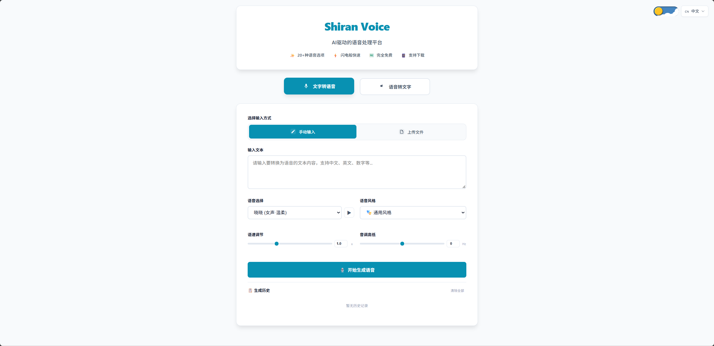
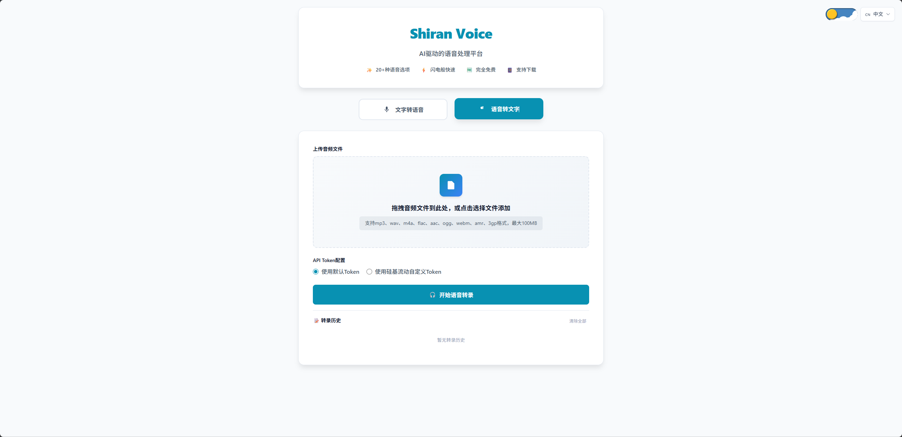

<p align="center">
  
</p>

<h1 align="center">🎙️ Shiran Voice</h1>
<p align="center"><strong>AI 语音处理平台 — 文字转语音 · 语音转文字 · 批量处理</strong></p>

<p align="center">
  <a href="https://github.com/shiranzby/TTS-STT/blob/main/LICENSE"></a>
  <a href="https://tts.shy2958779577.workers.dev"></a>
  
  
  <a href="https://deploy.workers.cloudflare.com/?url=https://github.com/shiranzby/TTS-STT"></a>
  
</p>

<p align="center">
  <a href="#-在线体验">在线体验</a> ·
  <a href="#-快速开始">快速开始</a> ·
  <a href="#-技术架构">技术架构</a> ·
  <a href="#-API-文档">API 文档</a> ·
  <a href="#-设计特色">设计特色</a> ·
  <a href="#-项目结构">项目结构</a>
</p>

---

## 📺 在线体验

<p align="center">
  <b>🌐 在线体验：</b><a href="https://tts.shy2958779577.workers.dev">demo</a>
</p>

| 文字转语音 | 语音转文字 | 批量处理 |
|:---:|:---:|:---:|
| 21 种中文语音 · 11 种风格 | mp3/wav/m4a 等格式 | 多文件拖拽 · 进度追踪 |
| 语速/音调可调 | 支持自定义 API Token | 逐个下载 / 全部导出 |
| 长文本自动分块并行合成 | 转录结果一键复制 | 🔄 失败重试 |

<p align="center">
  <a href="https://tts.shy2958779577.workers.dev">
    
  </a>
  <a href="https://tts.shy2958779577.workers.dev">
    
  </a>
  <br>
  <sub>📸 点击图片体验 demo · 支持日/夜模式 · 8 国语言</sub>
</p>

> 💡 **一键部署**：点击下方按钮即可将 Shiran Voice 部署到你自己的 Cloudflare 账号
>
> <a href="https://deploy.workers.cloudflare.com/?url=https://github.com/shiranzby/TTS-STT"></a>

---

## 🎯 功能概览

| 功能 | TTS（文字转语音） | STT（语音转文字） |
|------|:---:|:---:|
| **输入方式** | 手动输入 / .txt / .md 多文件批量 | 音频文件拖拽 / 多文件批量 |
| **语音/模型** | Microsoft Edge TTS（21 种中文语音） | SiliconFlow SenseVoiceSmall |
| **参数控制** | 语音选择 + 风格 + 语速 + 音调 | 默认 Token / 自定义 API Token |
| **结果操作** | ▶ 在线播放 · 📥 下载 MP3 | 📋 复制 · 📥 下载 TXT · 🔍 展开全文 |
| **批量处理** | ✅ 多文件逐个生成 · 📦 全部下载 | ✅ 多文件并行转录 · 📦 全部导出 |
| **断点续传** | ✅ 失败重试 · 已完成跳过 | ✅ 失败重试 · 已完成跳过 |
| **文件限制** | 单文件最大 100MB，内部自动分块 | 单文件最大 100MB |

---

## 🚀 快速开始

### 前置要求

- [Node.js](https://nodejs.org/) ≥ 18
- [Cloudflare 账号](https://dash.cloudflare.com/)
- [Wrangler CLI](https://developers.cloudflare.com/workers/wrangler/)：`npm install -g wrangler`

### 一键部署

方法一：点击上方 **[🚀 Deploy to Cloudflare Workers]** 按钮，按向导完成。

方法二：命令行部署

```bash
# 1. 克隆仓库
git clone https://github.com/shiranzby/TTS-STT.git
cd TTS-STT

# 2. 安装依赖
npm install

# 3. 构建（将前端 HTML 嵌入 Worker 代码）
npm run build

# 4. 登录并部署
npx wrangler login
npx wrangler deploy
```

部署成功后终端会输出你的 Workers 域名：
```
https://tts.<你的子域名>.workers.dev
```

### 配置 STT API Token（可选）

语音转录功能依赖硅基流动 API，建议配置自己的 Token：

```bash
npx wrangler secret put SILICONFLOW_TOKEN
```

不配置也可使用内置默认 Token（有频率限制）。

---

## 🧱 技术架构

### 整体架构

```
┌──────────────────────────────────────────────────────────────────┐
│                          浏览器 (前端)                            │
│  ┌────────────┐  ┌────────────┐  ┌──────────────────────────┐   │
│  │  文本输入   │  │  文件上传   │  │    批量多文件处理         │   │
│  │  (textarea) │  │ 拖拽/选择   │  │  逐个/追加/进度/重试     │   │
│  └─────┬──────┘  └─────┬──────┘  └───────────┬──────────────┘   │
│        └───────────────┼─────────────────────┘                  │
│                        ▼                                        │
│          POST /v1/audio/speech   (JSON / multipart)              │
│          POST /v1/audio/transcriptions  (multipart)              │
└─────────────────────────┬────────────────────────────────────────┘
                          │
                          ▼
┌──────────────────────────────────────────────────────────────────┐
│                    Cloudflare Worker (边缘计算)                    │
│                                                                   │
│  ┌────────────────────────┐       ┌──────────────────────────┐   │
│  │     TTS 合成引擎        │       │    STT 识别引擎          │   │
│  │                        │       │                          │   │
│  │  文本 → optimizedTextSplit()  │       │  音频 → 格式验证    │   │
│  │        ↓                │       │        ↓                │   │
│  │  (每块 ≤1500字符)       │       │  转发硅基流动 API       │   │
│  │        ↓                │       │   (SenseVoiceSmall)     │   │
│  │  每批3块 并行请求EdgeTTS │       │        ↓                │   │
│  │  (块间200ms/批间800ms)  │       │  清洗特殊标记 + emoji   │   │
│  │        ↓                │       │        ↓                │   │
│  │  合并所有 MP3 分片       │       │  返回 JSON 文本          │   │
│  └──────────┬─────────────┘       └───────────┬──────────────┘   │
│             │                                 │                  │
└─────────────┼─────────────────────────────────┼──────────────────┘
              │                                 │
              ▼                                 ▼
      ┌──────────────┐                  ┌──────────────┐
      │  MP3 音频流   │                  │  JSON 文本    │
      └──────┬───────┘                  └──────┬───────┘
             │                                 │
             ▼                                 ▼
      ▶ 在线播放 / 📥 下载              📋 复制 / 📥 下载 TXT
      📦 批量下载全部                   🔍 展开查看全文
```

### API 调用流程

```
用户/外部系统
     │
     ├─── curl / 第三方客户端
     │        │
     │        ├── POST /v1/audio/speech  ──→  JSON 文本 ──→ 返回 MP3
     │        │      Content-Type: application/json
     │        │      {"input":"你好","voice":"Xiaoxiao",...}
     │        │
     │        ├── POST /v1/audio/speech  ──→ 文件上传 ──→ 返回 MP3
     │        │      Content-Type: multipart/form-data
     │        │      file=@text.txt + voice + speed + pitch + style
     │        │
     │        └── POST /v1/audio/transcriptions ──→ 音频文件 ──→ 返回 JSON
     │               Content-Type: multipart/form-data
     │               file=@audio.mp3 + token(可选)
     │
     └─── 浏览器 UI
              │
              ├── 文本框 / 文件拖拽 ──→ fetch API ──→ 处理响应
              │
              └── 批量多文件 ──→ 循环 fetch + 进度更新 ──→ 逐一下载 / 全部导出
```

---

## 📡 API 文档

### `GET /`

返回完整的前端页面（HTML）。浏览器打开即可使用全部功能。

### `POST /v1/audio/speech` — 文字转语音

**JSON 模式（适用于短文本调用）：**

```bash
curl -X POST https://tts.<你的域名>.workers.dev/v1/audio/speech \
  -H "Content-Type: application/json" \
  -d '{
    "input": "你好，欢迎使用 Shiran Voice。",
    "voice": "zh-CN-XiaoxiaoNeural",
    "speed": "1.0",
    "pitch": "0",
    "style": "general"
  }' \
  --output speech.mp3
```

**Multipart 模式（适用于文件上传）：**

```bash
curl -X POST https://tts.<你的域名>.workers.dev/v1/audio/speech \
  -F "file=@text.txt" \
  -F "voice=zh-CN-XiaoxiaoNeural" \
  -F "speed=1.0" \
  -F "pitch=0" \
  -F "style=general" \
  --output speech.mp3
```

**请求参数：**

| 参数 | 类型 | 默认值 | 说明 |
|------|------|--------|------|
| `input` / `file` | string / file | — | 要合成的文本或文本文件 |
| `voice` | string | `zh-CN-XiaoxiaoNeural` | 21 种中文语音可选 |
| `speed` | float | `1.0` | 语速 (0.5~2.0) |
| `pitch` | integer | `0` | 音调 (-50~+50) |
| `style` | string | `general` | 11 种语音风格可选 |

**响应：** `audio/mpeg` — MP3 音频流。

### `POST /v1/audio/transcriptions` — 语音转文字

```bash
curl -X POST https://tts.<你的域名>.workers.dev/v1/audio/transcriptions \
  -F "file=@audio.mp3" \
  -F "token=sk-your-token"
```

**请求参数：**

| 参数 | 类型 | 必填 | 说明 |
|------|------|------|------|
| `file` | file | 是 | 音频文件（支持 mp3/wav/m4a/flac/aac/ogg/webm/amr/3gp） |
| `token` | string | 否 | 自定义硅基流动 API Token |

**响应：**
```json
{
  "text": "转录结果文本（已去除特殊标记）"
}
```

---

## ✨ 设计特色

### 🎨 界面设计
- **纯原生实现** — 零框架依赖，HTML5 + CSS3 + 原生 JavaScript
- **暗色/亮色主题** — 一键切换，自动保存偏好
- **响应式布局** — 桌面端 / 移动端自适应
- **8 国语言** — 中文 · English · 日本語 · 한국어 · Español · Français · Deutsch · Русский

### 🚀 批量处理
- 支持多文件拖拽和追加
- 每文件独立进度状态（待处理 → 处理中 → ✅ 完成 / ❌ 失败）
- 已完成文件可跳过，失败文件可单独重试
- 全部完成后一键导出（TTS 批量下载 / STT 全部复制）

### 🔧 稳定性
- 长文本自动分块并行合成，突破单次请求限制
- 内置重试机制（429 限频 / 5xx 服务端错误自动重试）
- 单文件 100MB 上限
- 生成历史 / 转录历史自动保存至 localStorage

---

## 📁 项目结构

```
TTS-STT/
├── src/
│   ├── template.html        # 完整前端 (HTML + CSS + JS)
│   ├── worker.js             # Cloudflare Worker 后端逻辑
│   └── worker_base.js        # 旧版 Worker（参考）
├── screenshots/
│   ├── demo-tts.png          # TTS 界面截图
│   └── demo-stt.png          # STT 界面截图
├── build.js                  # 构建脚本（内联 HTML → Worker）
├── index.js                  # 构建产物（单文件 Worker）
├── package.json              # 项目配置
├── wrangler.toml             # Wrangler 部署配置
├── LICENSE                   # MIT 许可证
├── .gitignore
└── README.md
```

**构建原理：** `build.js` 读取 `src/template.html` 和 `src/worker.js`，将 HTML 内联到 Worker 代码的 `/* __HTML_PAGE__ */` 占位符处，输出单文件 `index.js` 用于 Cloudflare 部署。

---

## 🔧 本地开发

```bash
# 本地预览
npm run build
npx wrangler dev

# 部署到生产环境
npm run deploy

# 设置环境变量（STT API Token）
npx wrangler secret put SILICONFLOW_TOKEN

# 多环境部署
npx wrangler deploy --env=production
npx wrangler deploy --env=staging
```

---

## 📝 License

MIT © Shiran

---

<p align="center">
  <sub>Made with ❤️ by Shiran</sub>
  <br>
  <a href="https://tts.shy2958779577.workers.dev">demo</a> ·
  <a href="https://github.com/shiranzby/TTS-STT">GitHub</a>
</p>
